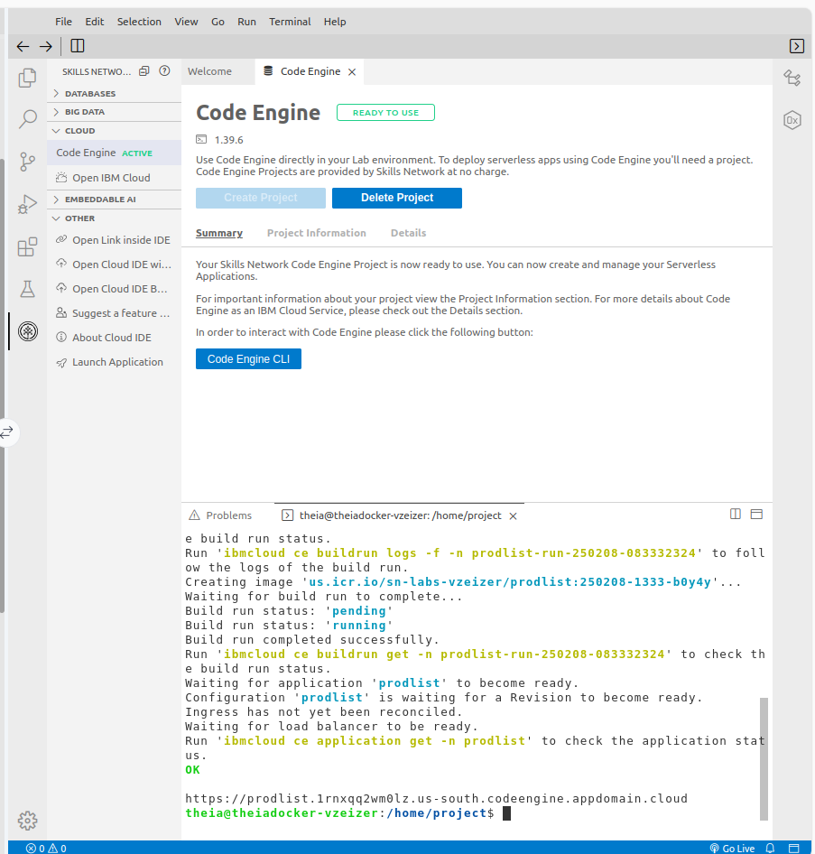
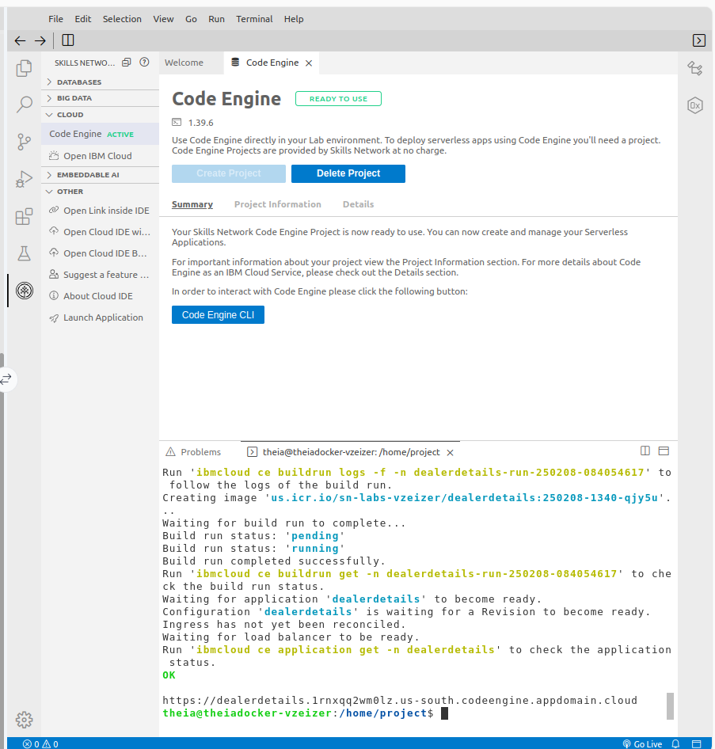
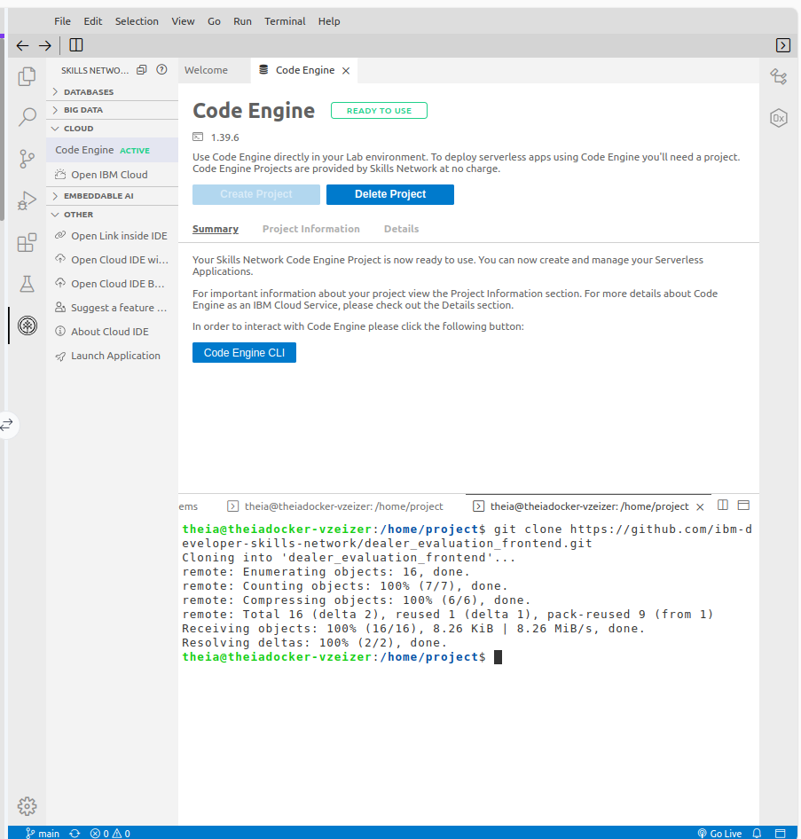
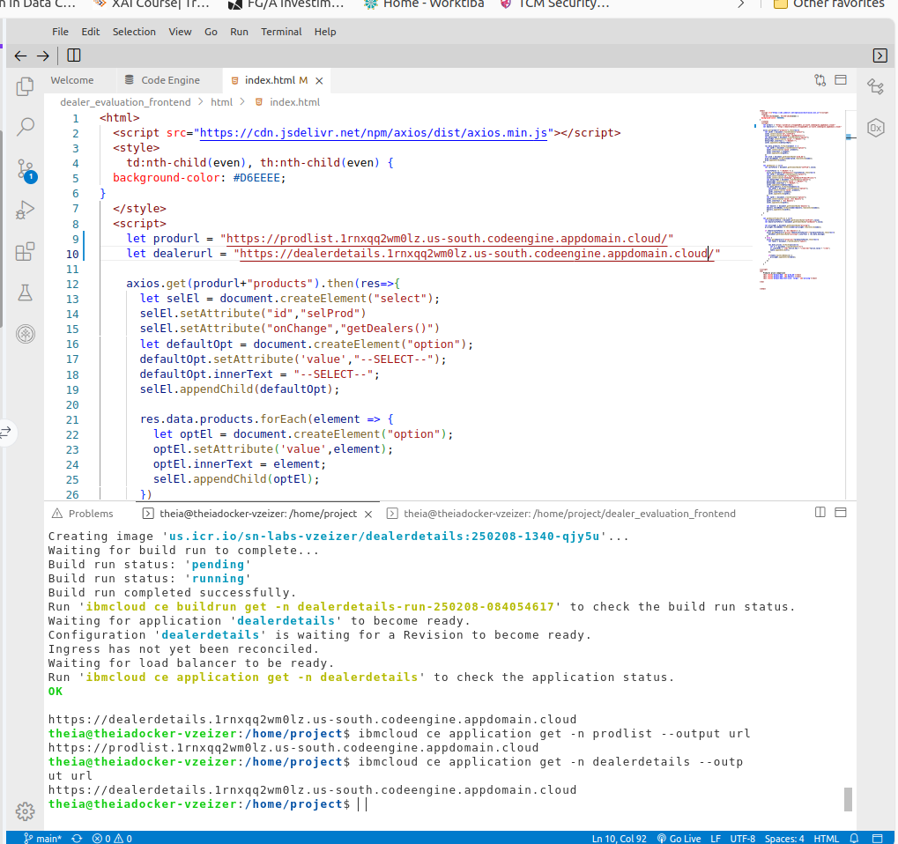
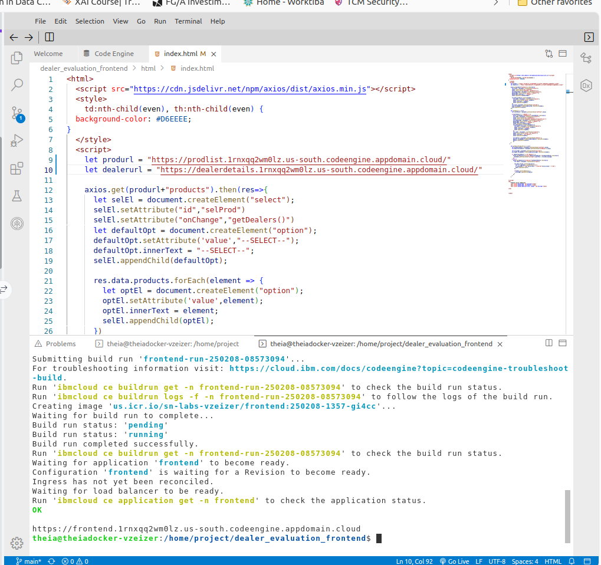
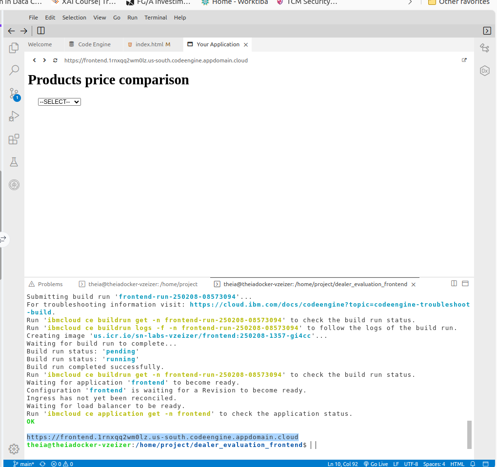
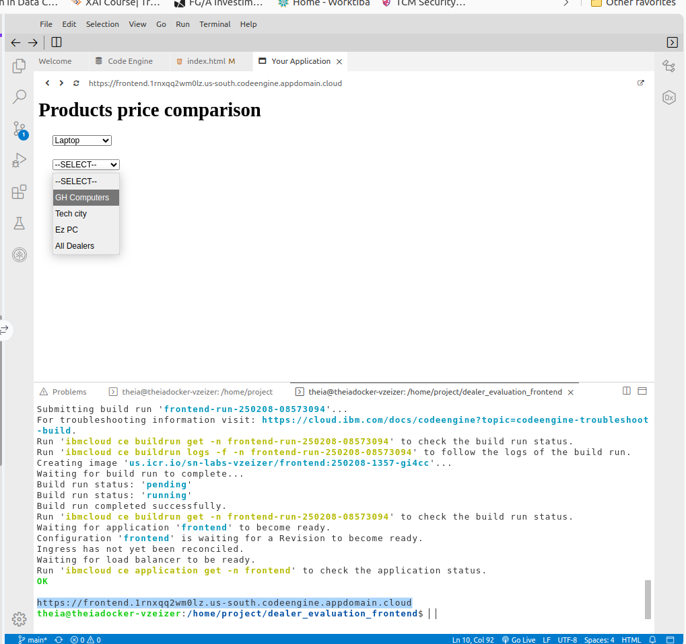
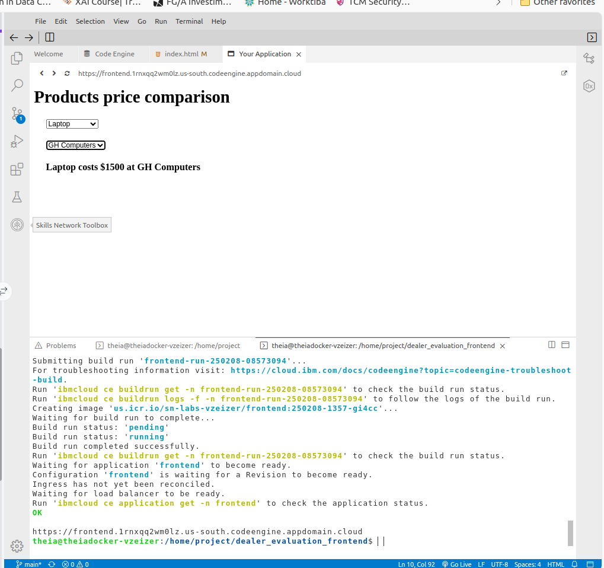

# MicroServices_Serverless_Coursera

Deploying the Backend Microservices
1. Open the Code Engine CLI.
2. Deploy the microservice for Product Details, which provides API endpoints to retrieve product information.

### 

